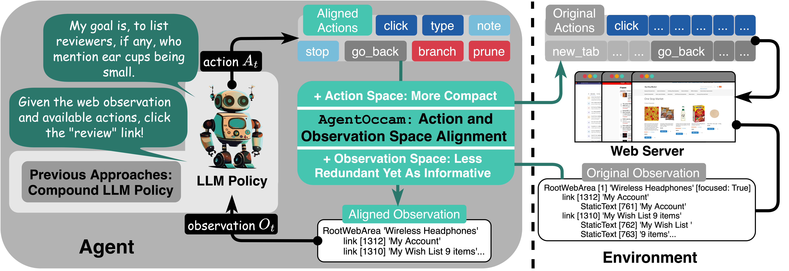

# AgentOccam
Code for "[AgentOccam: A Simple Yet Strong Baseline for LLM-Based Web Agents]()".



We work on automating web tasks! 🏄🏄🏄 We refine the LLM-based web agents by aligning their observation and action space with the capabilities of LLMs.

The newly designed agent AgentOccam surpasses previous state-of-the-art methods and concurrent work significantly w/o in-context examples, new agent roles, online feedback or search strategies on [WebArena](https://webarena.dev), a benchmark featuring general-purpose web tasks. 🍺

We shed light on LLMs' impressive zero-shot performance on web tasks, and the critical role of carefully tuning observation and action spaces for LLM-based agents. 🧙

You can let AgentOccam interact with other websites like Google per your requests by defining the task config files, as seen in the example in `config_files/tasks/standford_cs_head.json`. Have fun playing with it! :)

*Please check whether reddit post exceeds limits, login expires, or any other webarena simulator/website failure exists when you finish one round. You should restart the simluator/relogin to the websites and rerun those tasks before reporting your final success rate. Additionally, LLM policy varies even given the same task as the generation temperature is set to >0 for more diverse exploration. Therefore, it is expected that you can get difference traces when starting the same task multiple times. Try it out with the basic `config_files/tasks/standford_cs_head.json`!*

## WebArena Replication
### Environment Setup
```bash
git clone https://github.com/web-arena-x/webarena.git
cd webarena
conda create -n webarena python=3.10; conda activate webarena
pip install -r requirements.txt
pip install --upgrade transformers
pip install --upgrade openai
pip install numpy==1.26.4
playwright install
pip install -e .
cd ../AgentOccam
pip install -r requirements.txt
mkdir .auth
```

### Experiments
#### AgentOccam-Series and SteP-Replication
* Connect to the WebArena host server.
* Export the env configs:
```bash
export SHOPPING="http://<webarena_server_address>:7770"
export SHOPPING_ADMIN="http://<webarena_server_address>:7780/admin"
export REDDIT="http://<webarena_server_address>:9999"
export GITLAB="http://<webarena_server_address>:8023"
export MAP="http://<webarena_server_address>:3000"
export WIKIPEDIA="http://<webarena_server_address>:8888/wikipedia_en_all_maxi_2022-05/A/User:The_other_Kiwix_guy/Landing"
export HOMEPAGE="http://<webarena_server_address>:4399"
export OPENAI_API_KEY="<openai_api_key>"
export GEMINI_API_KEY="<gemini_api_key>"
```
* Login in:
```bash
python browser_env/auto_login.py
```
* Test AgentOccam:
```bash
python eval_webarena.py --config AgentOccam/configs/AgentOccam.yml # Replace the yml config with your target one.
```
*You can use directly run `bash script/run_config.sh` after replacing the experiment configurations.*
#### WebArena-Replication
```bash
bash scripts/run_webarena.sh
```

## WebVoyager Replication
### Environment Setup
```bash
git clone https://github.com/EmergenceAI/Agent-E.git
cd Agent-E
./install.sh
source .venv/bin/activate
uv pip install beartype
uv pip install gymnasium
uv pip install lxml
uv pip install text_generation
uv pip install aiolimiter
uv pip install boto3
uv pip install transformers
export OPENAI_API_KEY="<openai_api_key>"
export AUTOGEN_MODEL_NAME="gpt-4-turbo"
cd ../AgentOccam
```
### Experiments
#### AgentOccam
```bash
python eval_webarena.py --config AgentOccam/configs/AgentOccam-WebVoyager.yml
```
#### Agent-E
```bash
python -m agente_replication --task_ids Allrecipes--3
```


## Agent Configuration Explanation

They following are compiled based on `AgentOccam/configs/AgentOccam.yml`.

### General

```yml
logdir: "../AgentOccam-Trajectories"
```

This determines where the trajectories will be saved. Use relative path.

```yml
logname: "AgentOccam"
agent:
    others:
        logname: "AgentOccam"
```

All relevant online files (play series, trash series, and output/screenshot series) will use this log name to differentiate. Change them simultaneously.

### Agent
#### Base
```yml
agent:
    actor:
        debug: 0
        verbose: 1
        number: 1
    critic:
        mode: false
        debug: 0
        verbose: 1
    judge:
        mode: false
        debug: 0
        verbose: 1
```

All roles have a `debug` key. When `debug==1`, it plays and you decide whether to take its action. When `debug==2`, you will have to generate the action yourself. The actor is always playing so there's no `mode` key for it. For other roles, you can disable them by changing `mode` to false.

```yml
agent:
    actor:
        model: "gpt-4-turbo"
```

determines which model to use.

```yml
agent:
    actor:
        input: ["step", "objective", "previous plans", "interaction history", "current observation"]
```
arranges the input. The list element order matters here and this applies to all the following list input/output specifications.

```yml
agent:
    actor:
        interaction_history:
            verbose: True
            type: ["text"]
            step_num: 3
```
determines the interaction history section input type and modality. You can use `type: ["text", "image"]` to enable multimodality inputs.

```yml
agent:
    actor:
        current_observation:
            type: ["text"]
```
defines the current observation type.

```yml
agent:
    actor:
        output: ["interaction history summary", "observation description", "reason", "action", "observation highlight"]
```
organize the output specifications, and capable LLMs should generate those content, which would be parsed automatically by the code. You only need to add the description for that entry under `AgentOccam/prompts/output_specifications`.

```yml
agent:
    actor:
        planning_command: ["branch", "prune"]
        navigation_command: ["click", "type", "stop", "note", "go_back"]
```
defines the valid actions.

```yml
agent:
    actor:
        play: ["step", "objective", "previous plans", "observation description", "reason", "action"]
        trash: ["objective", "step", "url", "instruction", "online input", "response", "alter ego response"]
```
designates the broadcasting content.

#### Advanced
```yml
agent:
    actor:
        number: 1
```
If you use best-of-**N**-actions with judge, the `number` here defines the **N**.

```yml
agent:
    actor:
        identities:
            identity_0:
                name: "QA"
                model: "gpt-4-turbo"
                output: ["response"]
            identity_1:
                name: "planning"
                model: "gpt-4-turbo"
                planning_command: ["branch", "prune"]
                output: ["interaction history summary", "observation description", "reason", "plan", "observation highlight"]
            identity_2: 
                name: "reflection"
                model: "gpt-4-turbo"
                planning_command: ["branch", "prune"]
                navigation_command: ["click", "type", "stop", "note", "go_back"]
                output: ["interaction history summary", "observation description", "reflection", "reason", "action", "observation highlight"]
```
defines different actors. If you don't want them, comment them.

## Environment
```yml
env:
    fullpage: true
    prune: true
```
If `fullpage==True`, the agent takes the entire page as the input. Remember to add `scroll` to the `navigation_action` list if `fullpage` is disabled.

If `prune==True`, the pipeline carries out observation space alignment.